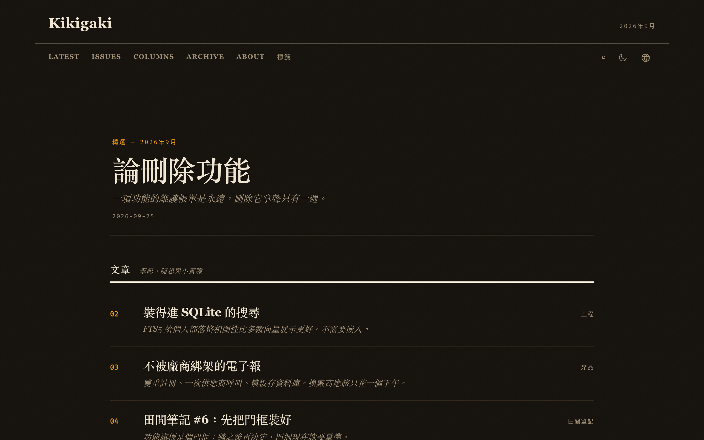
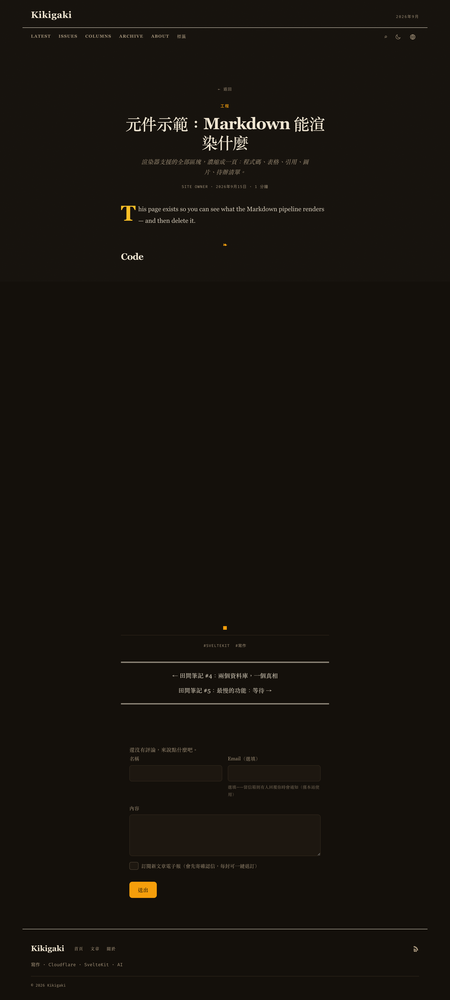
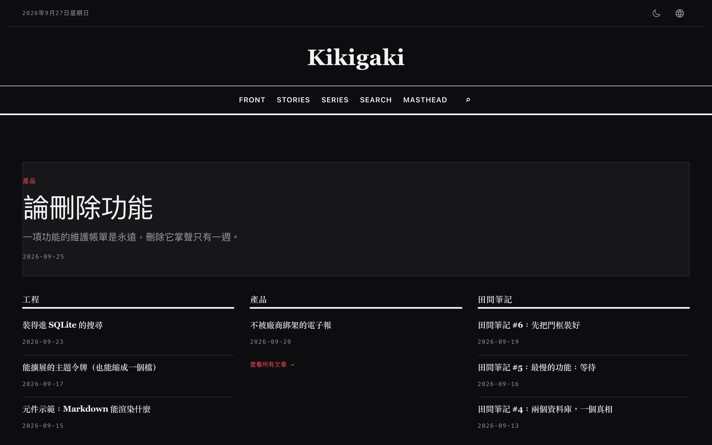
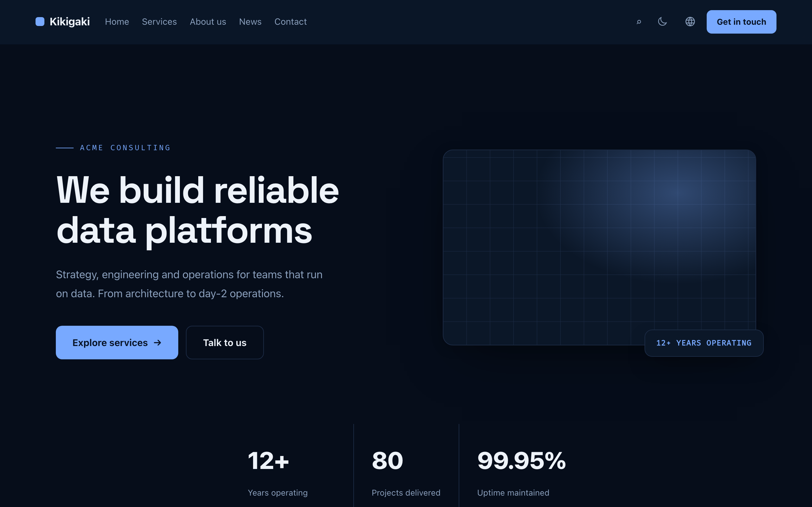

# Kikigaki

An animation-grade personal site platform. SvelteKit + Svelte 5 (runes) + Tailwind CSS v4 + GSAP,
deployed entirely on Cloudflare (Pages + D1 + R2) — or self-hosted with Docker/Node, same repo.

Traditional Chinese docs: [README.zh-TW.md](./README.zh-TW.md)

## Zero personal data, by design

The code ships **neutral factory defaults** — site name, author, socials and site URL are placeholders.
Your real identity lives in the database (admin panel), never in the repo. Fork, run one command,
introduce yourself in the settings — no code editing required.

## See it move

Everything below is rendered from the seeded demo content (`pnpm seed:demo`) — zero real data:


| Magazine (default)                     | Article & embedded components       | News broadsheet                           | Corporate                                           |
| -------------------------------------- | ----------------------------------- | ----------------------------------------- | --------------------------------------------------- |
|  |  |  |  |

## Stack

See [ARCHITECTURE.md](ARCHITECTURE.md) for the module map and the invariants (id conventions,
runtime layering, theme-slot contract) every PR must keep.

| Concern   | Choice                                            |
| --------- | ------------------------------------------------- |
| Framework | SvelteKit 2 + Svelte 5 (runes enforced)           |
| Styling   | Tailwind CSS v4 (typography / forms plugins)      |
| Motion    | GSAP (Core / ScrollTrigger / Flip) + Lenis        |
| Content   | mdsvex + `content/blog/*.md`                      |
| Data      | Cloudflare D1 (Drizzle ORM)                       |
| Storage   | Cloudflare R2 (media)                             |
| i18n      | Paraglide.js (base: zh-tw)                        |
| Deploy    | Cloudflare Pages (`@sveltejs/adapter-cloudflare`) |

## Getting started (fork path)

```bash
pnpm install
npx wrangler login          # once
pnpm cf:setup --name your-blog   # D1 + R2 + migrations + Pages project + secrets + demo post + deploy
```

Then open `https://your-blog.pages.dev/admin`:

1. First-run page creates your admin account (page closes permanently after)
2. Settings → **Site identity**: site name / author / canonical URL / socials (stored in DB)
3. Settings → **Email sending**: pick a provider (Resend free tier: 3,000/mo) for comment notifications
4. Want your own look: `pnpm theme:create my-theme --clone terminal`, or the no-Git **Theme workbench** below
5. Or let the in-site AI agent do any of the above (every write asks for your approval)

Known limits: Workers Free has no SMTP and 10 ms CPU per request (the agent works around it with
chunked pump loops — same architecture, not a capability cap); the language list is build-time
(`config/locales.json`); self-hosted SMTP is physically impossible on Workers — transactional mail
goes through HTTPS providers (Resend / SMTP2GO / Postmark / Mailgun / SES).

## Local development

```bash
pnpm install
pnpm dev
```

Dev reads D1/R2 bindings from `wrangler.toml` via `platformProxy` (wrangler's local state under
`.wrangler/state`). Before first use of D1 features:

```bash
pnpm db:generate
pnpm wrangler d1 execute kikigaki --local --file=./migrations/<file>.sql
```

## Scripts

```bash
pnpm dev              # dev server
pnpm build            # production build (output .svelte/cloudflare)
pnpm preview          # preview the production build
pnpm lint             # prettier + eslint
pnpm format           # prettier --write
pnpm check            # svelte-check types
pnpm test             # vitest (unit + component)
pnpm storybook        # Storybook
pnpm db:generate      # drizzle-kit migrations
pnpm db:studio        # drizzle studio
pnpm cf:setup --name X    # one-shot Cloudflare bootstrap (create resources, migrate, deploy)
pnpm seed:demo[:remote]   # curated fake posts: welcome, component demo, 6-part series, fillers (pagination-ready; idempotent)
pnpm seed:wipe[:remote]   # remove leftover e2e/test fixture posts
pnpm seed:theme news[:remote]  # load a theme_content preset + activate it: corporate|news|magazine
pnpm theme:create my-theme --clone terminal   # scaffold a Git-layer theme
pnpm i18n:sync        # compile per config/locales.json (CI runs automatically)
pnpm i18n:check       # settings/config drift gate (fails CI)
pnpm i18n:add ko --clone en   # new language (draft from an existing catalog; AI draft via --ai)
pnpm i18n:remove ko   # from catalog (translations kept in DB)
```

## Cloudflare setup (manual, if not using cf:setup)

1. `pnpm wrangler login`
2. `pnpm wrangler d1 create <project>` → put the returned `database_id` into `wrangler.toml`
3. `pnpm wrangler r2 bucket create <project>-assets`
4. Pages picks up bindings from `wrangler.toml` at deploy time

## Scheduled posts

Set a future **publish time** in the editor (with publish unchecked) and the post stays draft until
due. Every public read path (pages / RSS / sitemap / admin list) runs `publishDuePosts()` inline —
due posts flip to published on read and emit the usual events (search index, activity stamps).
Zero writes when nothing is due; no background worker needed. The 🕒 badge marks scheduled rows.
The agent's `publish_post` tool accepts `publishAt` (ISO) and schedules the same way.
Optionally keep zero-traffic hours punctual with `.github/workflows/cron-publish.yml`
(same `CRON_SECRET` on Pages secret + repo variable; fail-closed 403 without it — correctness
never depends on cron).

## Languages (build-time model, no runtime switch)

| Layer                                   | Where                                                                 | How to change                                 | Takes effect   |
| --------------------------------------- | --------------------------------------------------------------------- | --------------------------------------------- | -------------- |
| Catalog (what exists)                   | `config/locales-catalog.json` + `messages/*.json`                     | `pnpm i18n:add / i18n:remove` (PR)            | on merge       |
| Enabled subset (what this deploy ships) | `config/locales.json` (repo default) or GitHub env var `I18N_LOCALES` | edit on GitHub web / Environments → variables | next CI deploy |

The base language (`zh-tw` by default) is force-included. Missing catalogs, unknown codes or
duplicates fail `i18n:check` in CI before deploy. ko/es ship as unused draft catalogs — just add
the code to enable. Content translations live in the DB, independent of compilation.

## Comment moderation

Rules score risk → mid-risk gets AI assist → decision routes each comment (auto-publish / queue /
spam). Settings → Moderation: five strengths (off/lenient/normal/strict/custom thresholds) plus a
**banned-words list** (one per line) — banned hits never auto-publish, even on `off`.
One-level threaded replies; approved comments notify parents and admin via email.

## Email (Phase 67)

Six HTTPS providers, API keys stored AES-GCM encrypted (UI shows last four chars). Templates are
a small DSL (`<Email><Hero/><Button/></Email>`, whitelisted variables) with instant client-side
preview, versioning and rollback; delivery log at `/admin/email-logs`. Newsletter supports
double opt-in subscriptions and one-click unsubscribe. Agent tools for templates are
high-approval (same policy as theme writes).

## Digital goods & support (Phase 79e)

Opt-in storefront for **digital goods only** (e-books, templates, wallpapers — Gumroad-shaped,
not a general e-commerce system: no inventory, shipping, tax or multi-variant SKUs). A content
type becomes a product when it carries the price/file contract (see
`skills/add-content-type/SKILL.md`); checkout, webhook, and token-gated delivery are automatic.
Providers come from env alone — with no payment env set, the whole kit is dormant.

```bash
# Providers (all plain fetch, zero SDK). PAYMENT_PROVIDER selects — comma list
# ("stripe,paypal") shows a payment-method picker at checkout; unset = every
# fully-keyed provider. Each needs its own secrets:
#   stripe:    STRIPE_SECRET, STRIPE_WEBHOOK_SECRET
#   paypal:    PAYPAL_CLIENT_ID, PAYPAL_SECRET (+ PAYPAL_WEBHOOK_ID for the
#              fallback webhook; PAYPAL_ENV=live to leave sandbox)
#   airwallex: AIRWALLEX_CLIENT_ID, AIRWALLEX_API_KEY, AIRWALLEX_WEBHOOK_SECRET
#              (demo endpoint unless AIRWALLEX_ENV=prod)
wrangler secret put STRIPE_SECRET
# local demo flow without any real keys (NEVER enable both flags in production):
echo 'PAYMENT_PROVIDER="mock"' >> .dev.vars
echo 'ALLOW_MOCK_PAYMENTS="1"' >> .dev.vars
```

Buy-me-a-coffee support (tip orders, no product): enable surfaces
(`post,support,about`) in Admin → Settings; renders a SupportZone card and a
`/support` page on the chosen spots. Amount reuses the price contract.

Webhooks: point each provider at `/api/checkout/webhook/<provider-name>`
(e.g. `/api/checkout/webhook/stripe`). Digital goods only — refunds revoke
delivery tokens automatically via `markRefunded` (Stripe `charge.refunded`).

## Themes

Two layers, by design:

- **Git-layer themes** (`pnpm theme:create`) — full build-time components: structure packs, tokens,
  behavior presets (transition / preloader / stagger), any imports incl. GSAP scroll storytelling.
  Scaffold registers into THEME_IDS / manifest / registry / token block automatically; the admin
  theme list is manifest-driven — new themes appear with zero wiring.
- **DB-layer themes** (no Git) — Settings-adjacent **Theme workbench** (`/admin/themes`): pick a base
  theme, paste design tokens CSS, override any of the 11 layout slots (Header/Footer/Home/Blog/
  Post/…) with Svelte code; every save compiles-test-checks all slots; apply takes effect instantly;
  the AI agent can author themes behind high-approval. Behaviors (curtain/fade, preloader, stagger
  scale) are overridable per theme. Honest boundary: DB surfaces compile client-side (same pipeline
  as Workshop custom components) — SSR and pre-compile frames honestly show the base theme's
  structure while tokens/colors land on first paint (SSR-inlined) and compiled artifacts are cached
  in IndexedDB across visits. Need full SSR structure? Use the Git layer.
- Themes are **portable**: workbench export produces a `kikigaki-theme/1` `.zip`
  (manifest + tokens + slot sources); import runs path/size/security gates and stores it un-activated.

## Database backups

`.github/workflows/backup-d1.yml` exports the production D1 daily (16:30 UTC). Destination is a repo
variable: `artifact` (default, 14-day Actions artifact) or `r2` (bucket of your choice). Restore:
`wrangler d1 execute <project> --remote --file=backup-<stamp>.sql`.

## OG fallback

Posts without a cover fall back to the site default OG image, then to the brand card
`static/og-default.jpg` (1200×630 @2x) — share cards never degrade to plain text.

## Self-host (Docker / Node) — same repo, second adapter

`ADAPTER=node pnpm build` produces a plain Node server with a D1 shim (better-sqlite3) and an
R2 shim (local files) injected via `node-shim/` — admin, posts, comments, email, agent: everything
works without a Cloudflare account.

```bash
docker compose up -d --build   # runs all migrations on first boot
open http://localhost:3000/admin
```

- Behind HTTPS: set `ORIGIN` to your domain (adapter-node assumes https; unset triggers CSRF 403s)
- Set `AI_SECRET` (credential encryption key); empty `TURNSTILE_SECRET` skips bot checks
- The agent runs full speed on self-host (10 steps / 12 tools per request); set `SELF_HOST_STEPS`
  lower behind tight reverse-proxy timeouts
- Dev note: node builds pollute `.svelte-kit` — `rm -rf .svelte-kit` before returning to CF dev
- No Docker: `ADAPTER=node pnpm build && node node-shim/migrate.mjs && node server.mjs`

**Fly.io**: `fly.toml` ships with the repo — `fly launch --copy && fly volumes create kikigaki_data
--size 1 && fly secrets set AI_SECRET=… && fly deploy` (SQLite + uploads live on the volume).

**Mainland-China VPS**: mirrors, ICP filing reality, SMTP/port-25 notes and a checklist in
[DEPLOY-CHINA.md](DEPLOY-CHINA.md) (zh-TW).

## Agent skills (repo-native how-tos)

[`skills/`](skills/) holds task recipes written for AI coding agents **and** humans:
`add-a-pack` (Git theme), `add-content-type` (79 registry), `theme-tokens` (no-git DB themes),
`selfhost-deploy`, `e2e-authoring`. Each pins the invariants that bite (see
[ARCHITECTURE.md](ARCHITECTURE.md)).

## Deploy (GitHub Actions)


Pipeline (`.github/workflows/ci.yml`): quality gate → PR preview deploys (URL posted as PR comment)
→ production on `main` behind **environment approval** (build → D1 migrations → Pages deploy →
smoke checks). One-time setup: repo/environment secrets `CLOUDFLARE_API_TOKEN` +
`CLOUDFLARE_ACCOUNT_ID`, environment `production` with a required reviewer. Project names and URLs
come from repo variables (`PAGES_PROJECT`, `D1_DATABASE`, `PRODUCTION_URL`) — forks need zero file
edits. Manual fallback: `pnpm build && pnpm exec wrangler pages deploy .svelte/cloudflare --project-name <project>`.

## License

MIT — see [LICENSE](./LICENSE).
